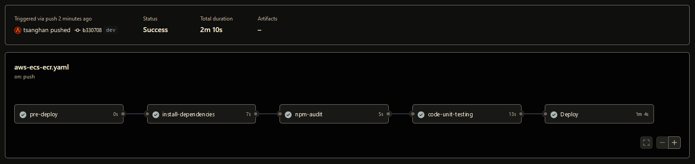

# sctp-ce6-mod3.11

[][def]

[def]: https://github.com/tsanghan/sctp-ce6-mod3.11/actions/workflows/aws-ecs-ecr.yaml

## Documentation

The command to create this GitHub repository.

```
gh repo create sctp-ce6-mod3.11 --public --license mit --add-readme --gitignore Terraform
```

The `.gitignore` file have to be manually adjusted by adding content of [`Python`](https://github.com/github/gitignore/blob/main/Python.gitignore) gitignore file and content of [`Node`](https://github.com/github/gitignore/blob/main/Node.gitignore) gitignore file.

The creation of `dev` environment in GitHub Action is by the following `gh` command with `api` call.

```
gh api --method PUT -H "Accept: application/vnd.github+json" repos/tsanghan/sctp-ce6-mod3.11/environments/dev
```
All necessary `secrets` and `variable` for `dev` Environment are created as follow.

```
 gh variable set AWS_REGION --body "ap-southeast-1" -e dev
 gh variable set ECR_REPOSITORY --body "tsanghan-ce6/hello-app" -e dev
 gh variable set ECS_SERVICE --body "tsanghan-ce6-service" -e dev
 gh variable set ECS_CLUSTER --body "tsanghan-ce6-ecs-cluster" -e dev
 gh variable set CONTAINER_NAME --body "tsanghan-ce6-container" -e dev
 gh variable set REGISTRY_ALIAS --body "u2q1a2y8" -e dev
```
Key ID and Access Key are set with the following command template.
```
 gh secret set SOME_NAME --body "${SOME_VALUE}" -e dev
```
Replace `SOME_NAME` and `SOME_VALUE` accordingly.

## Infrastructure
AWS ECS Cluster is create first manually. The Terraform/OpenTofu configuration files in the [`ecs-cluster`](https://github.com/tsanghan/sctp-ce6-mod3.11/tree/main/ecs-cluster) directory.

## ECS Service & Task deploymwnt with Application
The ECS Service & Task Terraform/OpenTofu configuration files are in [`ecs-service-task`](https://github.com/tsanghan/sctp-ce6-mod3.11/tree/main/ecs-service-task) directory. This is managed by GitHub Action workflow [`aws-ecs-ecr.yaml`](https://github.com/tsanghan/sctp-ce6-mod3.11/blob/main/.github/workflows/aws-ecs-ecr.yaml)

The application is written in `Nodejs` and is in the [`app/node`](https://github.com/tsanghan/sctp-ce6-mod3.11/tree/main/app/node).

Unit tests with `Jest` is also written as part of the CI process.

There is an anternative application written in `Python`, however, as per assigment reequirement, `Nodejs` is required.
As such, no unit tests for `Python` applicaiton is written and GitHub Action workflow is tuned for `Nodejs` application.

On `push` to `dev` environment, GitHub Action workflow in the file `aws-ecs-ecr.yaml` will kick off. A CI pipeline is implemented as shown below,



1) `pre-deploy`
2) `install-dependencies`
3) `npm-audit`
4) `code-unit-testing`

are done as part of CI.

Finally, a `deployment` is done as the last `job` os the workflow;

5) a `Nodejs` application `Docker` image is created and pushed to AWS ECR public registory in a precreated repository
6) a `ECS Task Definition` defined in the Terraform/OpenTofu configuration file is send via Terraform/OpenTofu command to AWS in the pipeline, to deploy the containerizaed Nodejs Application.

Finally, extra configuration is done to enable container logs being captured and send to `CloudWatch`.